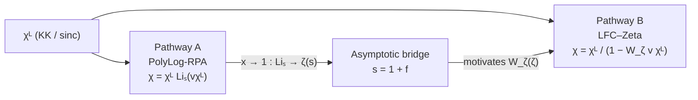

# Dual-Pathway Strong-Coupling Regularization

**Status:** Theory frozen in `manuscript/two-fermi.tex` (Sec.~V + Appendix D); Pathway~B (LFC–Zeta) is the live multi-component production default; Pathway~A (PolyLog-RPA) is live as a **scalar** CLI diagnostic (`--pathway polylog-rpa --scalar-diagnostic`).  
**Parent:** [`zeta_rpa_integration.md`](zeta_rpa_integration.md) · [`simulator_architecture.md`](simulator_architecture.md)  
**Numbering:** Matches manuscript appearance order — **A = PolyLog-RPA**, **B = LFC–Zeta (production)**.

---

## Dual-Pathway Regularization Architecture

Ordinary RPA resumes the bare Coulomb bubble as a geometric series that collapses when $v\chi^L\to 1$. MosaiQ-Lindhard answers that failure with **two parallel frameworks** that share the same causal Lindhard input $\chi^L$ and the same thermodynamic distance $f(\Gamma,r_s,\tau)$, but play different roles.

### Pathway A — PolyLog-RPA (formal definition)

Microscopic diagrammatic expansion with topological penalty $n^{-s}$ on the $n$-th bubble chain:

$$
\chi^{(s)}(q,\omega)
=
\chi^L(q,\omega)\,
\mathrm{Li}_s\!\bigl(v(q)\chi^L(q,\omega)\bigr)
=
\chi^L(q,\omega)
\sum_{n=1}^{\infty}
\frac{\bigl(v(q)\chi^L(q,\omega)\bigr)^n}{n^s}\,.
$$

| Limit | Content |
|-------|---------|
| $s\to 0$ | RPA ladder content ($\mathrm{Li}_0$) |
| $x\equiv v\chi^L\to 1$, $\Re s>1$ | $\mathrm{Li}_s(1)=\zeta(s)$ (Riemann-zeta boundary) |

Pathway~A is the **exact series definition** of the regularized **scalar** vertex sum. It is not algebraically identical to Pathway~B on the full $(q,\omega)$ mesh, and it does **not** extend naively to coupled two-component RPA: there the resummation is matrix-valued, $\boldsymbol{\chi}^{\mathrm{RPA}}=\boldsymbol{\chi}^{L}(\mathbf{1}-\mathbf{v}\boldsymbol{\chi}^{L})^{-1}$, so a scalar $\mathrm{Li}_s(v\chi^L)$ cannot be applied channel-by-channel without breaking interspecies structure. A matrix polylogarithm would require a separate spectral calculus outside the present production path.

### Pathway B — LFC–Zeta / Zeta-RPA (production Ansatz)

Macroscopic local-field-correction (LFC) skeleton used for all current manuscript numerics and the live multi-component CLI default:

$$
\chi^{\zeta}(q,\omega)
=
\frac{\chi^L(q,\omega)}{1 - v(q)\,W_\zeta\,\chi^L(q,\omega)}\,,
\qquad
W_\zeta\equiv 1-G_\zeta\,.
$$

Production weight (Laurent-regularized):

$$
W_\zeta =
\begin{cases}
1\,, & f=0\ (\Gamma\to 0)\,,\\[0.35em]
f\,\zeta(1+f)\,, & f>0\,,
\end{cases}
\qquad
f=\alpha\frac{\Gamma^{\beta}}{1+\gamma\,r_s^{-\delta}\,\tau}\,.
$$

Locked baseline: $\alpha=0.05$, $\beta=\gamma=\delta=1$. Conceptual ratio form $W_\zeta=\zeta(1+f)/\zeta(1)$ is equivalent after Laurent regularization of the divergent $\zeta(1)$.

**Zeta-RPA is retained.** Pathway~B remains the production default; PolyLog-RPA does not replace it.

### The Bridge ($x\to 1$ asymptotic projection)

At the catastrophe boundary the PolyLog series accumulates singular mass $\zeta(s)$, while the LFC geometric series $\sum_n (W x)^n$ accumulates $W/(1-W)$. Equating these macroscopic singular masses motivates determining $W$ from the absolutely convergent zeta sector with the **same** regularizing argument

$$
s = 1 + f(\Gamma,r_s,\tau)\,.
$$

The pathways are therefore joined by **asymptotic projection**, not by claiming $\chi^{(s)}\equiv\chi^{\zeta}$ everywhere.

---

## Causality doctrine (unchanged)

Both pathways may dress the interaction ladder. **Neither** may renegotiate $\Im\chi^L$ or replace the Hilbert/sinc construction of $\Re\chi^L$. No Matsubara pole sums.

---

## See also

- CLI and cost notes: [`usage.md`](usage.md)
- Engine phases Z1–Z4 (Zeta matrix, Borwein, gates): [`zeta_rpa_integration.md`](zeta_rpa_integration.md)
