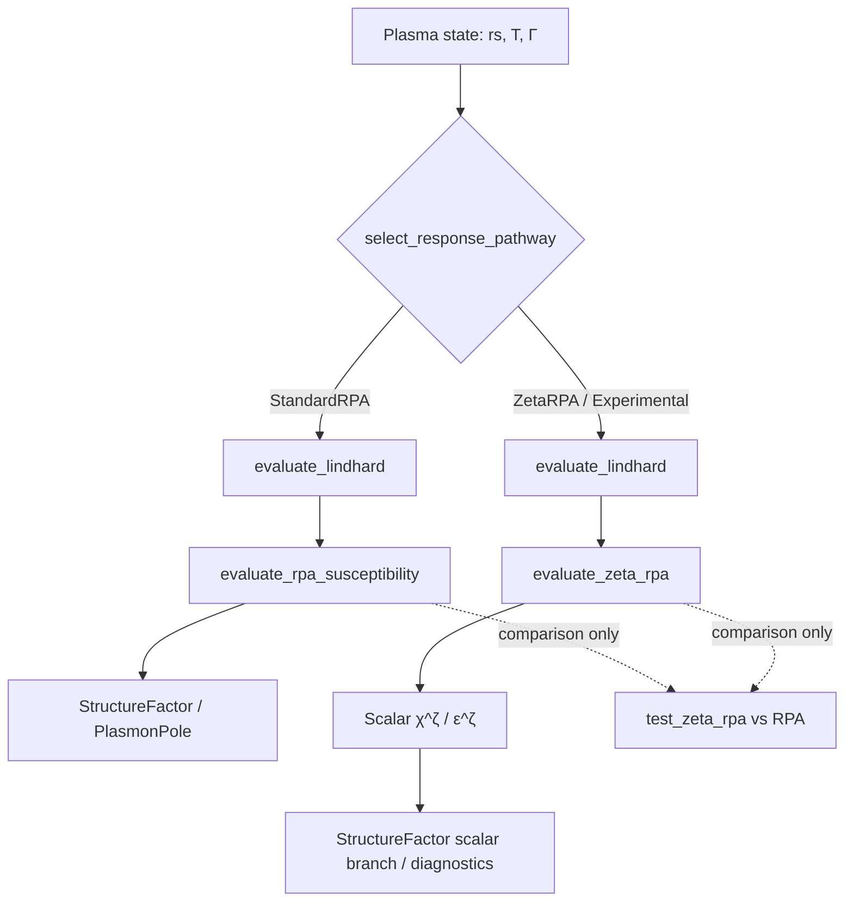
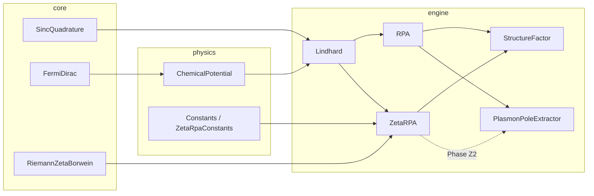
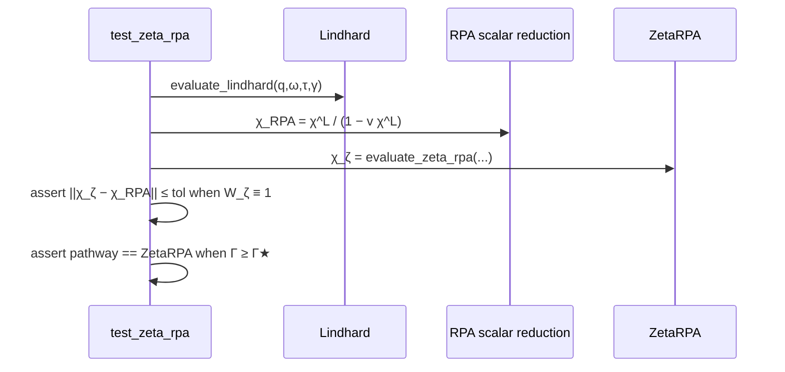

# MosaiQ-Lindhard: Zeta-RPA Integration Blueprint

**Status:** Architecture Blueprint — Phase Z1–Z4 complete (versioned switch: multi-component ZetaRPA is production default)  
**Protocol:** Pontifex — *Arx Axiomatis* under Imperator  
**Theory Reference:** `manuscript/two-fermi.tex` — *Linear response representation of two-fermion plasmas*  
**Parent Blueprint:** `docs/simulator_architecture.md`  
**Purpose:** Define the deterministic insertion of a **Zeta-RPA** pathway that extends the causality-constrained Lindhard baseline into the strong-coupling regime, without contaminating the audited weak-coupling RPA stack already validated in Phases 3–6.

**Doctrine (absolute).** Zeta-RPA is permitted to dress the interaction ladder; it is forbidden to renegotiate causality (KK/sinc pathway remains absolute).

**Implementation status (Phase Z4 — versioned switch).** `evaluate_rpa_response` defaults to multi-component `ZetaRPA` via DOS-restored `evaluate_zeta_rpa_matrix`. CLI default is `--pathway zeta-rpa`. Legacy undressed RPA remains `--pathway standard-rpa`. Scalar grids are opt-in via `--scalar-diagnostic`.

### CLI usage (Phase Z4 versioned switch)

```bash
# Production default — multi-component Zeta-RPA structure factors + dispersion
./simulator/build/mosaiq_simulator 1.0 10000
./simulator/build/mosaiq_simulator --pathway zeta-rpa 1.0 10000

# Legacy undressed two-component RPA
./simulator/build/mosaiq_simulator --pathway standard-rpa 1.0 10000

# Opt-in scalar Zeta diagnostic grids
./simulator/build/mosaiq_simulator --scalar-diagnostic --pathway zeta-rpa --gamma 50 1.0 1000
# → output/output_zeta_rpa_scalar.dat
# → output/output_zeta_rpa_dispersion.dat
#   python3 scripts/plot_zeta_rpa_dispersion.py

# Static S(q) Gamma sweep (inherits --pathway; default ZetaRPA)
./simulator/build/mosaiq_simulator --gamma-sweep 1 10,50,100,150
./simulator/build/mosaiq_simulator --pathway standard-rpa --gamma-sweep 1 10,50,100,150
```

Stderr prints a pathway header, e.g. `ResponsePathway: ZetaRPA (production multi-component Zeta-RPA; strong-coupling window)`.

Strong-coupling exploration: `verify_zeta_rpa_scalar` → `output/zeta_rpa_strong_coupling_{sweep,rescue}.dat`;
plot with `scripts/plot_zeta_rpa_strong_coupling.py`.

**Strongest divergence-rescue observed (Phase Z1 stress test):** parking the scalar interaction on the RPA pole $v\approx 1/\Re\chi^L$ (and Coulomb amplifications up to $200\times$), scalar RPA yields $\mathrm{Inf}/\mathrm{NaN}$ or $|\chi|\gtrsim 10^{14}$ while Zeta-dressed responses remain finite. Strongest logged Experimental rescue block: **$r_s=4$, $\Gamma=200$**. With the locked production $W_\zeta$, production `zeta-rpa` also departs from bare RPA at finite $\Gamma$ and can shift dielectric zeros.

---

## 1. Mission Statement

The finite-temperature Lindhard engine of MosaiQ-Lindhard establishes an absolute, Kramers–Krönig–compliant bare susceptibility $\chi^L(q,\omega;\tau)$ on the real frequency axis. That baseline is necessary but not sufficient for dense plasmas: at large plasma coupling $\Gamma$ (or metallic $r_s$ deep in the strongly interacting sector), the bare Coulomb bubble resummed by ordinary RPA fails to encode exchange–correlation vertex structure.

**Zeta-RPA** is the Pontifex answer to that failure mode. It constructs a *scalar, single-component* response correction whose analytic skeleton is tied to the Riemann zeta function $\zeta(s)$—evaluated by the deterministic Borwein algorithm—and whose dynamical content remains anchored to the same sinc-quadrature Lindhard imaginary part that already governs causality. Standard RPA is not “patched”; it is **bypassed by explicit policy** when the thermodynamic state enters a declared strong-coupling window.

Design priorities, inherited and extended from the parent architecture:

1. **Determinism** — identical inputs yield bit-identical outputs (within documented floating-point policy); Borwein truncation order is a pinned compile- or run-time constant, never an adaptive heuristic.
2. **Type-safe physics** — wave vectors, frequencies, reduced temperatures, and coupling parameters remain distinct strong types; dimensional aliasing remains a compile error.
3. **Zero hidden state** — Zeta-RPA evaluation is a pure function of immutable inputs; no process-global caches, no silent fallback to standard RPA.
4. **Traceability** — every Zeta-RPA curve intended for the manuscript must be reproducible from a single CLI or CTest invocation with pinned $(r_s, T, \Gamma)$ (or equivalent) and a documented Borwein depth $N$.
5. **Causality inviolability** — $\Re\chi^L$ continues to be obtained solely from the Hilbert / sinc pathway of $\Im\chi^L$. Zeta-RPA is permitted to dress the interaction ladder; it is forbidden to renegotiate causality (KK/sinc pathway remains absolute). It must never resurrect Matsubara pole sums, contour residues, or ensemble-mixed analytic continuations.

---

## 2. Placement in the Repository

### 2.1 Directory Structure (delta relative to parent blueprint)

```
simulator/
├── CMakeLists.txt
├── src/
│   ├── core/
│   │   ├── …                          # existing: SincQuadrature, FermiDirac, Brent, …
│   │   └── RiemannZetaBorwein.hpp / .cpp
│   │                                  # Deterministic ζ(s) via Borwein series
│   ├── physics/
│   │   └── …                          # unchanged in Phase Z0–Z1
│   ├── engine/
│   │   ├── Lindhard.hpp / .cpp        # unchanged producer of χ^L
│   │   ├── RPA.hpp / .cpp             # retained weak-coupling pathway
│   │   ├── StructureFactor.hpp / .cpp # consumer; gains optional Zeta-RPA branch
│   │   ├── PlasmonPoleExtractor.*     # Phase Z2+: optional dielectric from Zeta-RPA
│   │   └── ZetaRPA.hpp / .cpp
│   │                                  # Scalar single-component Zeta-RPA response
│   └── main.cpp                       # CLI flag / mode to select ResponsePathway
└── tests/
    ├── test_riemann_zeta_borwein.cpp
    ├── test_zeta_rpa.cpp
    └── …                              # existing suite remains green and untouched
```

| Layer | Module | Role |
|-------|--------|------|
| **core** | `RiemannZetaBorwein` | Pure arithmetic: evaluate $\zeta(s)$ (and documented auxiliary zeta-family values) by Borwein’s convergent series to a pinned truncation depth. No plasma physics. |
| **engine** | `ZetaRPA` | Physics: assemble the scalar Zeta-RPA susceptibility / dielectric dressing from Lindhard $\chi^L$ and zeta-derived coupling weights; enforce strong-coupling bypass policy. |

**Separation axiom.** `RiemannZetaBorwein` shall not include `engine/` headers. `ZetaRPA` may depend on `core/` and on `Lindhard` / `Concepts`; it must not mutate `RPA.hpp` internals. Standard RPA remains a peer pathway, not a base class of Zeta-RPA.

### 2.2 Build Contract

Unchanged from the parent blueprint:

| Requirement | Policy |
|-------------|--------|
| Standard | `CMAKE_CXX_STANDARD 20`, extensions off |
| Warnings | `-Wall -Wextra -Wpedantic -Werror` |
| Library | New `.cpp` units link into `mosaiq` static library |
| Tests | CTest executables; no network; no wall-clock randomness |

---

## 3. Purpose of the Zeta-RPA Module

### 3.1 Physical mandate

Ordinary RPA in MosaiQ-Lindhard implements the two-component dielectric and susceptibility matrix

$$
\varepsilon = 1 - v_{ee}\chi_e^L - v_{ii}\chi_i^L + (v_{ee}v_{ii}-v_{ei}^2)\chi_e^L\chi_i^L ,
\qquad
\chi^{\mathrm{RPA}}_{st} = \ldots
$$

as audited in `engine/RPA`. That construction is exact only within the bubble-resummation (weak vertex) idealization. In the **strong-coupling regime**, exchange–correlation physics demands a controlled dressing of the interaction line. Zeta-RPA supplies that dressing for the **single-component scalar** problem first:

$$
\chi^{\zeta}(q,\omega)
=
\frac{\chi^L(q,\omega)}{1 - v(q)\,W_\zeta\!\bigl[\chi^L;\,q,\omega;\,\Gamma\bigr]\,\chi^L(q,\omega)} ,
$$

where $W_\zeta$ dresses the bare interaction. **Locked production form (Phase Z1):**

$$
W_\zeta(\Gamma, r_s, \tau)
=
\frac{\zeta\Bigl(1 + \alpha \dfrac{\Gamma^{\beta}}{1 + \gamma\, r_s^{-\delta}\,\tau}\Bigr)}{\zeta(1)}\,.
$$

The parameters $\alpha$, $\beta$, $\gamma$, $\delta$ are theory parameters fixed in the manuscript (Appendix C).

**Numerical regularization.** The pole $\zeta(1)=\infty$ is removable in the weak-coupling limit: with
$f=\alpha\Gamma^{\beta}/(1+\gamma r_s^{-\delta}\tau)$, the Laurent expansion $\zeta(1+f)\sim 1/f+\gamma_E+\cdots$ implies the IEEE-evaluable equivalent

$$
W_\zeta \;=\;
\begin{cases}
1, & f=0\ (\Gamma\to 0),\\[4pt]
f\,\zeta(1+f), & f>0\ \text{(Borwein, argument $>1$)},
\end{cases}
$$

which satisfies $W_\zeta\to 1$ as $\Gamma\to 0$ and is the production implementation in `evaluate_zeta_weight`. `ZetaRPA_Experimental` retains a separate provisional probe dress for A/B diagnostics only.

### 3.2 What Zeta-RPA is not

| Forbidden construction | Rationale |
|------------------------|-----------|
| Matsubara pole summation for $\chi^L$ | Already excluded by the parent architecture; Zeta-RPA inherits the ban. |
| Contour / Jordan closure shortcuts | Same ban; real-axis causality remains absolute. |
| Silent fallback to `evaluate_rpa_susceptibility` when Zeta-RPA fails | Failure must return `std::optional` / explicit error; never a quiet RPA substitution. |
| Phenomenological bridge functions as production defaults | Bridge / HNC closures may appear only as **negative regression fixtures**, never as the production $W_\zeta$. |
| In-place mutation of `RpaResult` | Zeta-RPA returns its own result type; comparison with RPA is explicit and logged. |

### 3.3 Pontifex reading

The Lindhard engine proved that finite-$T$ causality heals the $T\to 0$ topological defects of contour methods. Zeta-RPA is the next pontifical span: it carries that healed bare response into the strongly coupled liquid without reintroducing the analytic vices the manuscript condemned. The zeta function enters not as ornament, but as the **canonical regularizer** of the coupling ladder that ordinary RPA truncates too early.

---

## 4. Interface Design — Single-Component Scalar Case

**Phase Z1 delivered scalar-only.** Multi-component matrix structure is **Phase Z3** (Section 9, now implemented); Phase Z1 commits froze the scalar algebra without introducing $\{ee,ii,ei\}$ Zeta-RPA types.

### 4.1 Core: `RiemannZetaBorwein`

```cpp
namespace mosaiq {

/// Policy for deterministic Borwein evaluation of ζ(s).
struct BorweinPolicy {
    std::size_t truncation_order{N_default};  // pinned; documented in tests
    double absolute_tolerance{/* … */};
};

/// Evaluate ζ(s) for real s > 1 (Phase Z1), by Borwein’s convergent series.
template<ScalarPhysical T = double>
[[nodiscard]] T riemann_zeta_borwein(T s, BorweinPolicy policy = {});

/// Optional: ζ(2k) closed forms via Bernoulli (compile-time where possible).
template<ScalarPhysical T = double>
[[nodiscard]] constexpr T riemann_zeta_even_integer(std::size_t k) noexcept;

}  // namespace mosaiq
```

**Acceptance (core):** For a documented set $\{s_i\}$ (e.g. $s=2,3,4,\ldots$ and a non-integer probe), relative error versus known values / high-precision reference ≤ policy tolerance at fixed `truncation_order`. Bit-identical on repeated calls.

### 4.2 Engine: `ZetaRPA`

```cpp
namespace mosaiq {

enum class ResponsePathway {
    StandardRPA,            // existing evaluate_rpa_* / evaluate_rpa_response
    ZetaRPA,                // production scalar pathway (W_ζ locked-or-identity)
    ZetaRPA_Experimental,   // non-production probe; never default for manuscript figures
};

/// Thermodynamic / coupling gate for pathway selection.
template<ScalarPhysical T = double>
struct CouplingRegime {
    T rs{};
    T gamma_plasma{};   // Γ (or manuscript-equivalent coupling)
    T tau{};            // reduced temperature of the active species
};

/// Returns true iff the state lies in the declared strong-coupling window.
template<ScalarPhysical T = double>
[[nodiscard]] constexpr bool is_strong_coupling(CouplingRegime<T> regime) noexcept;

/// Scalar Zeta-RPA result (single component).
template<ScalarPhysical T = double>
struct ZetaRpaResult {
    std::complex<T> chi{};           // χ^ζ(q, ω)
    std::complex<T> epsilon{};       // 1 − v_eff χ^L  (or manuscript-equivalent)
    T zeta_weight{};                 // W_ζ diagnostic (auditable)
    ResponsePathway pathway{ResponsePathway::ZetaRPA};
};

template<ScalarPhysical T = double>
struct ZetaRpaInputs {
    WaveVector<T> q{};
    Frequency<T> omega{};
    LindhardResult<T> chi_lindhard{};  // DOS-restored (natural) units at the v(q) boundary
    T bare_potential{};                // v(q) for the scalar species
    CouplingRegime<T> regime{};
    BorweinPolicy borwein{};
    ResponsePathway pathway{ResponsePathway::ZetaRPA};
    bool force_pathway{false};         // honor requested Zeta* outside strong-coupling gate
};

/// Pure evaluation. Returns nullopt if inputs are non-finite or outside domain.
template<ScalarPhysical T = double>
[[nodiscard]] std::optional<ZetaRpaResult<T>>
evaluate_zeta_rpa(const ZetaRpaInputs<T>& inputs);

}  // namespace mosaiq
```

**Interface invariants**

1. `evaluate_zeta_rpa` consumes a **precomputed** `LindhardResult` (or an equivalent complex $\chi^L$ after DOS restoration). It does not reimplement Lindhard.
2. `zeta_weight` is always populated on success so CTest and CLI dumps can audit $W_\zeta$.
3. Strong types (`WaveVector`, `Frequency`, …) are mandatory at the public boundary; raw `double` overload—if any—lives only in CLI glue, not in the engine API.

### 4.3 Pathway selector (bypass contract)

```cpp
template<ScalarPhysical T = double>
[[nodiscard]] ResponsePathway
select_response_pathway(CouplingRegime<T> regime,
                        ResponsePathway requested,
                        bool force_pathway = false,
                        bool auto_bypass = false) noexcept;
```

**Explicit policy — never silent:**

| Requested | Regime | Flags | Selected |
|-----------|--------|-------|----------|
| `StandardRPA` | any | `auto_bypass=false` | `StandardRPA` |
| `StandardRPA` | strong | `auto_bypass=true` | `ZetaRPA` (production dress) |
| `ZetaRPA` / `ZetaRPA_Experimental` | strong | any | requested pathway |
| `ZetaRPA` / `ZetaRPA_Experimental` | weak | `force_pathway=false` | `StandardRPA` |
| `ZetaRPA` / `ZetaRPA_Experimental` | weak | `force_pathway=true` | requested pathway |

`ZetaRPA_Experimental` is never chosen by auto-bypass; only an explicit request (optionally forced) may select it. Auto-bypass defaults **off** so two-component manuscript pipelines remain on `StandardRPA`.

The precise auto-bypass thresholds $(\Gamma_\star, r_s^\star, \tau_\star)$ are theory parameters; the architecture requires them to be **named constants** in `physics/Constants.hpp` (or a dedicated `ZetaRpaConstants.hpp`), not magic numbers in `.cpp` files.

---

## 5. Bypassing Standard RPA in the Strong-Coupling Regime

### 5.1 Policy



**Rules**

1. **No shared mutable buffer** between RPA and Zeta-RPA evaluations.
2. **Bypass is explicit:** CLI (`--pathway zeta-rpa` / `--pathway zeta-rpa-experimental` / `--pathway rpa`) or `ResponsePathway` argument; auto-bypass, if enabled, writes a one-line reason to stderr / run header and may select only production `ZetaRPA`, never `ZetaRPA_Experimental`.
3. In the strong-coupling window, production structure-factor export for the **scalar** channel shall call `evaluate_zeta_rpa`, not `evaluate_rpa_susceptibility`.
4. Two-component `RpaResult` remains the undressed comparison oracle. **Phase Z4** promotes multi-component `ZetaRPA` as the production default for structure-factor exports; `StandardRPA` is retained as an explicit legacy pathway.

### 5.2 Effective interaction

$$
v_{\mathrm{eff}}(q;\Gamma,r_s,\tau)
=
v(q)\,W_\zeta(\Gamma,r_s,\tau)\,,
\qquad
\varepsilon^\zeta = 1 - v_{\mathrm{eff}}\,\chi^L\,,
$$

with the locked weight

$$
W_\zeta(\Gamma, r_s, \tau)
=
\frac{\zeta\Bigl(1 + \alpha \dfrac{\Gamma^{\beta}}{1 + \gamma\, r_s^{-\delta}\,\tau}\Bigr)}{\zeta(1)}\,.
$$

The parameters $\alpha$, $\beta$, $\gamma$, $\delta$ are theory parameters fixed in the manuscript (Appendix C). Numerically, $W_\zeta=f\,\zeta(1+f)$ with $f=\alpha\Gamma^{\beta}/(1+\gamma r_s^{-\delta}\tau)$ (Laurent regularization of the $\zeta(1)$ pole; $W_\zeta=1$ at $f=0$).

$W_\zeta \to 1$ must recover ordinary scalar RPA identically (bit-level within roundoff) at $\Gamma\to 0$. That identity is a **hard regression gate** (Section 7).

---

## 6. Integration Points with Existing Modules

### 6.1 Data-flow map



### 6.2 Concrete touch points

| Existing symbol | Integration rule |
|-----------------|------------------|
| `evaluate_lindhard` | Sole producer of bare $\chi^L$ for both pathways. |
| `as_complex` / `susceptibility_in_natural_units` | Reused to place $\chi^L$ in the unit convention expected by $v(q)$. |
| `evaluate_rpa_susceptibility` | **Untouched** production API; used as comparison oracle in tests. |
| `evaluate_rpa_response` (`StructureFactor`) | Production entry: defaults to multi-component `ZetaRPA` via DOS-restored `evaluate_zeta_rpa_matrix`; `StandardRPA` remains an explicit legacy pathway. |
| `dynamic_structure_factor` | Remains FDT wrapper $S \propto -\Im\chi\,(1+n_B)$; accepts $\chi$ from either pathway. |
| `PlasmonPoleExtractor` | Phase Z2: scalar overload `extract(PlasmonPoleZetaInputs)` with objective `Re ε^ζ(q,ω)=0` (and scalar `StandardRPA` comparison); two-component path still undressed unless a future $\varepsilon^\zeta$ overload is added. |
| `main.cpp` | `--pathway standard-rpa|zeta-rpa|zeta-rpa-experimental` (**default `zeta-rpa`**). Production runs export multi-component structure factors; scalar grids are opt-in via `--scalar-diagnostic`. |

### 6.3 CMake

- Add `src/core/RiemannZetaBorwein.cpp` and `src/engine/ZetaRPA.cpp` to the `mosaiq` library target.
- Register `test_riemann_zeta_borwein` and `test_zeta_rpa` in `simulator/tests/CMakeLists.txt`.

---

## 7. Validation Strategy

### 7.1 Unit layer — `test_riemann_zeta_borwein.cpp`

| Case | Expectation |
|------|-------------|
| $\zeta(2)=\pi^2/6$ | Relative error ≤ $10^{-14}$ (double) at default Borwein depth |
| $\zeta(4)=\pi^4/90$ | Same |
| $\zeta(3)$ vs pinned reference digits | Match to documented ulps |
| Repeated call bit-identity | Exact equality of return bits |
| Out-of-domain $s\le 1$ (Phase Z1) | `nullopt` or documented exception policy—never NaN |

### 7.2 Unit / integration — `test_zeta_rpa.cpp`

| Case | Expectation |
|------|-------------|
| **Weak-coupling identity** | $W_\zeta\to 1$ ⇒ $\|\chi^\zeta - \chi^{\mathrm{RPA}}_{\mathrm{scalar}}\| \le$ tol for a dense $(q,\omega)$ sample |
| **Causality inheritance** | $\chi^L$ from Lindhard KK; Zeta-RPA must not alter $\Im\chi^L$ except through the algebraic dressing formula |
| **Strong-coupling bypass** | For $\Gamma\ge\Gamma_\star$, `select_response_pathway` returns `ZetaRPA` under auto policy; CLI header records the choice |
| **Failure honesty** | Non-finite $v$ or $\chi^L$ ⇒ `nullopt`; no fallback to RPA |
| **Sum-rule smoke** (Phase Z1.1) | Scalar $f$-sum / conductivity weight within tolerance vs standard RPA at weak $\Gamma$ |
| **Regression vs manuscript grid** | At least one pinned $(r_s,T,q,\omega)$ golden vector committed under `simulator/tests/data/` (or generated by a deterministic fixture) |

### 7.3 Comparison protocol vs standard RPA



**Scalar reduction of existing RPA.** For comparison only, define a one-component reference by setting $\chi_i^L=0$, $v_{ii}=v_{ei}=0$, $v_{ee}=v(q)$ through the existing `evaluate_rpa_susceptibility` API (or an equivalent pure formula). This reuses the audited dielectric algebra without forking a second “toy RPA.”

### 7.4 Non-goals for Phase Z1 tests

- Full two-component Zeta-RPA matrix.
- Plasmon dispersion replacement in published Fig. 5.
- Bridge-function / HNC cross-validation as a pass criterion.

---

## 8. Phased Execution Roadmap

### Phase Z0 — Architecture freeze (this document)

**Deliverable:** `docs/zeta_rpa_integration.md` reviewed by Imperator.  
**Exit gate:** No C++ until explicit authorization.

### Phase Z1 — Core zeta + scalar Zeta-RPA

**Deliverables**

- `RiemannZetaBorwein` + unit tests
- `ZetaRPA` scalar API + weak-coupling identity tests
- Pathway selector constants
- Optional CLI diagnostic dump (not required to alter default figure pipelines)

**Exit gate:** CTest green; weak-coupling identity holds; strong-coupling bypass logs explicitly.

### Phase Z2 — Dielectric roots

**Deliverables**

- Feed $\varepsilon^\zeta$ into `PlasmonPoleExtractor` under an explicit pathway switch (`PlasmonPoleZetaInputs`)
- Landau damping from $\Im\varepsilon^\zeta$ at the Brent root
- CTest `test_zeta_rpa_dielectric` (Γ ≥ 100 root + amplified-$v$ rescue)
- CLI comparison grid `output_zeta_rpa_dispersion.dat`

**Exit gate:** $|{\rm Re}\,\varepsilon^\zeta(q,\omega_p)|\le 10^{-8}$ at documented reference states; two-component `StandardRPA` extract API unchanged.

**Plotting:** `scripts/plot_zeta_rpa_dispersion.py` — two-panel Bohm–Gross / scalar RPA / Zeta-RPA rescue figure from `output_zeta_rpa_dispersion.dat` (candidate “Figure X”).

### Phase Z3 — Multi-component promotion ✅

**Deliverables**

- `ZetaRpaMatrixInputs` / `ZetaRpaMatrixResult` in `ZetaRPA.hpp`
- `evaluate_zeta_rpa_matrix` — per-channel $W_\zeta^{ee,ii,ei}$ dress of the audited $2\times 2$ RPA inverse
- Species-asymmetric regimes (`regime_e`, `regime_i`) with arithmetic-mean cross regime for $W_\zeta^{ei}$
- CTest: matrix weak-coupling identity vs `evaluate_rpa_susceptibility`; no silent StandardRPA fallback

**Exit gate:** When all $W\to 1$, matrix channels match `evaluate_rpa_susceptibility` to $10^{-14}$. **Met.**

### Phase Z4 — Manuscript coupling + versioned switch ✅

**Deliverables**

- Section V in `manuscript/two-fermi.tex`: scalar Zeta-RPA (`sec:zeta-rpa`) + asymmetric matrix subsection (`sec:zeta-rpa-matrix`)
- Appendix C coefficients for $W_\zeta$
- Figure 10: `zeta_rpa_dispersion.pdf`
- Versioned switch: multi-component ZetaRPA is production default in `StructureFactor` / CLI

**Exit gate:** Theory docs synchronized with live matrix architecture; APS zip includes Fig. 10 stem. **Met** (static $S(q)$ figure regeneration under Zeta default is the remaining visualization step).

---

## 9. Implemented Architecture — Multi-Component Asymmetric Zeta Matrix

**Status:** Phase Z3 complete; Phase Z4 versioned switch live. Multi-component Zeta-RPA is the **production default** for structure-factor and Gamma-sweep exports (`evaluate_rpa_response` → `evaluate_zeta_rpa_matrix` with DOS-restored $\chi^L$). Legacy undressed RPA remains `--pathway standard-rpa`. Scalar Zeta-RPA remains the diagnostic / plasmon-rescue pathway (`--scalar-diagnostic`).

The matrix pathway preserves the audited $\{ee,ii,ei\}$ channel layout of `RpaResult` while dressing each bare Coulomb line with an independent zeta weight. Bare Lindhard susceptibilities $\chi_e^L$ and $\chi_i^L$ are never renegotiated—only $v_{st}\to v_{st}^\zeta$.

### 9.1 Dressed potentials and cross-channel regime

Per-channel effective interactions:

$$
v_{st}^{\zeta}(q) = v_{st}(q)\,W_\zeta^{st}\,,
\qquad
st\in\{ee,ii,ei\}\,.
$$

Diagonal weights use species-local thermodynamic regimes $(\Gamma_e,r_{s,e},\tau_e)$ and $(\Gamma_i,r_{s,i},\tau_i)$. Because of extreme mass asymmetry ($m_i\gg m_e$), these regimes are independent. The off-diagonal cross channel uses the **arithmetic mean** regime

$$
\Gamma_{ei}=\frac{\Gamma_e+\Gamma_i}{2}\,,
\qquad
r_{s,ei}=\frac{r_{s,e}+r_{s,i}}{2}\,,
\qquad
\tau_{ei}=\frac{\tau_e+\tau_i}{2}\,,
$$

so that $W_\zeta^{ei}=W_\zeta(\Gamma_{ei},r_{s,ei},\tau_{ei})$ preserves algebraic symmetry of $v_{ei}=v_{ie}$ and the weak-coupling continuity $\lim_{\Gamma\to 0}W_\zeta^{st}=1$ on every channel.

### 9.2 Two-component dressed dielectric and response tensor

With $v_{st}^\zeta$ substituted into the audited RPA algebra (`RPA.cpp` with $v\to Wv$):

$$
\varepsilon^{\zeta}(q,\omega)
=
\bigl(1 - v_{ee}^{\zeta}\chi_e^L\bigr)
\bigl(1 - v_{ii}^{\zeta}\chi_i^L\bigr)
-
\bigl(v_{ei}^{\zeta}\bigr)^2\,\chi_e^L\,\chi_i^L\,,
$$

and the electron–electron tensor element (representative)

$$
\chi_{ee}^{\zeta}(q,\omega)
=
\frac{
\chi_e^L - \chi_e^L\,v_{ii}^{\zeta}\,\chi_i^L
}{\varepsilon^{\zeta}(q,\omega)}\,,
$$

with $\chi_{ii}^{\zeta}$ and $\chi_{ei}^{\zeta}$ obtained by the same substitution into Eqs.~(response-ee)–(response-ei) of the manuscript. When all $W_\zeta^{st}\to 1$, the matrix recovers `evaluate_rpa_susceptibility` to $10^{-14}$ (CTest gate).

### 9.3 Production types

```cpp
template<ScalarPhysical T = double>
struct ZetaRpaMatrixResult {
    std::complex<T> chi_ee{};
    std::complex<T> chi_ii{};
    std::complex<T> chi_ei{};
    std::complex<T> epsilon{};  // ε^ζ dielectric determinant
    T zeta_weight_ee{};
    T zeta_weight_ii{};
    T zeta_weight_ei{};
    ResponsePathway pathway{ResponsePathway::ZetaRPA};
};
```

| Symbol | Role |
|--------|------|
| `ZetaRpaMatrixInputs` | DOS-restored $\chi_e^L$, $\chi_i^L$; bare $v_{st}$; `regime_e`, `regime_i`; `force_pathway` |
| `evaluate_zeta_rpa_matrix` | Pure matrix evaluation; no silent StandardRPA fallback |
| `evaluate_rpa_response` | StructureFactor production entry; default pathway `ZetaRPA` |

### 9.4 Architectural invariants (locked)

1. **Algebraic continuity:** $W_\zeta^{st}\to 1$ ⇒ bit-stable match to undressed two-component RPA.
2. **Species asymmetry:** Independent $\Gamma_e$, $\Gamma_i$ on diagonals; arithmetic-mean $\Gamma_{ei}$ on the cross channel.
3. **Causality inviolability:** $\chi^L$ remains the KK/sinc Lindhard input; only the interaction ladder is dressed.
4. **Versioned switch:** Production default is multi-component ZetaRPA; `StandardRPA` is explicit legacy.
5. **Dependency direction:** Matrix may call scalar `evaluate_zeta_weight`; scalar must never depend on matrix types.
6. **Extractor:** Two-component `PlasmonPoleExtractor` still consumes undressed $\varepsilon$ unless a future overload supplies $\varepsilon^\zeta$; scalar Zeta poles remain Phase Z2.

```
RiemannZetaBorwein  →  ZetaRPA (scalar)  →  ZetaRPA (matrix)
                              ↓
                     StructureFactor / CLI  (default: matrix ZetaRPA)
```

---

## 10. Relationship to the Manuscript and Pontifex Doctrine

| Manuscript / doctrine element | Zeta-RPA module |
|------------------------------|-----------------|
| Section IV — KK / sinc Lindhard | Upstream, inviolable input |
| Finite-$T$ regularization of static $\chi^L$ | Prerequisite narrative for introducing analytic dressing |
| Strong-coupling / vertex-corrected RPA (forward look in main text) | `engine/ZetaRPA` |
| Riemann zeta (Edwards; appendix zeta identities) | `core/RiemannZetaBorwein` |
| Appendices F–G anti-patterns | Remain unimplemented; Zeta-RPA must not revive them |
| Stratonovich / reverse-Dedekind excision | Inherited automatically via Lindhard; not re-coded in Zeta-RPA |

**Doctrine sentence.** Zeta-RPA is permitted to dress the interaction ladder; it is forbidden to renegotiate causality (KK/sinc pathway remains absolute).

---

## 11. Open Decisions (resolve before API freeze)

1. **Exact $W_\zeta$ formula** — **locked** as $\zeta(1+f)/\zeta(1)$ with Laurent production form $W=f\zeta(1+f)$, $f=\alpha\Gamma^{\beta}/(1+\gamma r_s^{-\delta}\tau)$. Coefficients $(\alpha,\beta,\gamma,\delta)$ await final Appendix C numerical freeze (defaults ship in `Constants.hpp`).
2. **Unit convention** — Phase Z1 picks **DOS-restored (natural) units** at the `ZetaRpaInputs` / $v(q)$ boundary.
3. **Auto-bypass defaults** — **off** (explicit `--pathway`) for reproducibility of existing figures; auto-bypass never selects `ZetaRPA_Experimental`.
4. **Domain of $\zeta(s)$** — Phase Z1 restricted to real $s>1$ (ensured by $1+f$ with $f>0$).
5. **Floating-point policy** — Borwein sums accumulate in `double` (align with current Lindhard/`double` stack).

---

## 12. Explicit Non-Goals (historical Phase Z1 fence; superseded where noted)

- ~~Replacing two-component manuscript pipelines in place.~~ → Superseded by Phase Z4 versioned switch.
- ~~Multi-component Zeta-RPA types (strictly Phase Z3).~~ → Implemented (Section 9).
- Embedding phenomenological bridge / HNC closures as production $W_\zeta$.
- Claiming a frozen $W_\zeta$ formula before the manuscript lock. *(formula locked; Appendix C coefficients remain provisional defaults)*
- Parallelism / GPU offload.
- Networked or adaptive “precision oracles” for $\zeta(s)$.
- Multi-component $\varepsilon^\zeta$ plasmon extraction in Fig. 5 (scalar Zeta poles only to date).

---

*Document version: 1.5 — Phase Z3/Z4: Section 9 promoted to Implemented Architecture (asymmetric multi-component Zeta matrix; production default). Locked $W_\zeta=\zeta(1+f)/\zeta(1)$ with Laurent production $W=f\zeta(1+f)$.*
